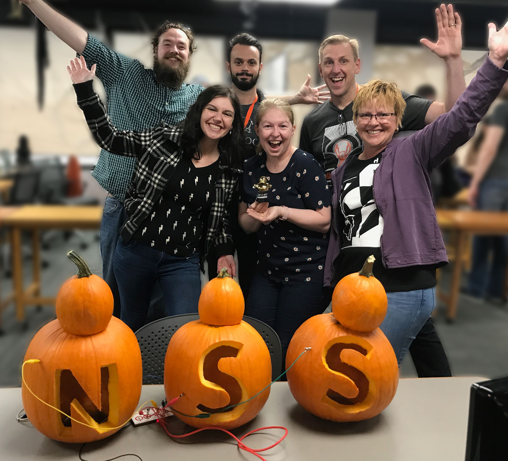

# Hack-O-Lantern

### This repository holds the incredibly creative efforts of a handful of NSS Grads and current students over the course of the 2019 Halloween weekend Hack-O-Ween Hackathon.

## Project Overview:

The main objective of this project was to create a game using pumpkins as controllers. Additionally, we wanted to integrate a feature that would take the player's photo if they won the game, and then display all the winner photos on a second monitor.

## Gameplay

Tap the pumpkin in the center to start the game. Tap the pumpkin on the right or left to move your character on the screen. The goal is to collect the letters N-S-S in the same color while avoiding the bugs which slow you down. Collecting a lightning bolt zaps all your bugs and you regain your original speed. Catch three bugs and your game is over. Grab a cup of coffee and you get a caffeine boost and your speed doubles. Win the game and get your photo taken and displayed with the rest of the winners.

[**Full demo video**](https://learn.nashvillesoftwareschool.com/blog/2019/10/31/hack-tastic-hack-o-ween-hackathon) on the NSS Blog

## Technologies Used

- [Phaser](https://phaser.io/) - gameplay framework
- [Makey Makey](https://makeymakey.com/) - pumpkin controllers interface
- [Firebase](https://firebase.google.com/) - photo storage

## The Hackolantern Dev Team

- [Adam Sheaffer](https://github.com/AdamSheaffer)
- [Bryan Nilsen](https://github.com/BryanNilsen)
- [Madi Peper](https://github.com/MissPeperr)
- [Brenda Long](https://github.com/brendalong)
- [Nolan Little](https://github.com/Nolan-Little)
- [Melody Stern](https://github.com/melliemuse)
- [Jeremiah Bell](https://github.com/Belljeremiah)
- [Matthew Ross](https://github.com/spuuun)

This project was designed and built in under 42 hours. Fueled by caffeine, pizza, laughter, and high-fives.
